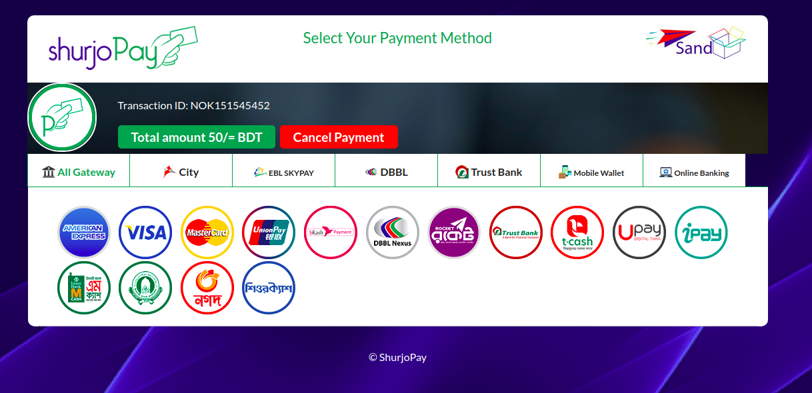

# ShurjoPay
shurjopay python integration steps

## Prerequisite
To integrate ShurjoPay you need few credentials to access shurjopay here's a test credentials for example:

```
MERCHANT_USERNAME = '******'
MERCHANT_PASSWORD = '**********'
SHURJOPAY_URL = 'https://shurjotest.com/sp-data.php'
DECRYPT_URL = 'https://shurjotest.com/merchant/decrypt.php'
MERCHANT_PREFIX = 'NOK'
``` 
note*

these are stage credentials only for test purpose.
for live integration custom credentials (Merchant_username, merchant_password, shurjopay_url, dycrypt_url, merchant_prefix) will be given to you after you purchase/enroll shurjoPay gateway.

**Create a POST API/ URL** 

e.g: http://127.0.0.1:8000/return_url/

This return URL is required to be passed to the shurjoPay where a encrypted transaction info will be posted.
so the return URL will be ```POST``` method and it will accept with ```spdata``` from shurjoPay.
## Installation

Use the package manager ```pip``` to install Shuropay python package
```
pip install -i https://test.pypi.org/simple/ shurjopay-pkg-tareq
```
## Usage
```
from shurjopay import shurjoPay

#initialize with the test credentials

testpay = shurjoPay.ShurjoPay(MERCHANT_USERNAME, MERCHANT_PASSWORD, SHURJOPAY_URL, DECRYPT_URL, MERCHANT_PREFIX)

```
now the payment transaction can be initiated and 
send ```client_ip```, ```transaction_id``` (note: transaction id should be an unique id with the given prefix for each request. For test environment you may use "NOK".), ```transaction_amount```, ```return_url``` with the ```send_request``` method
```
spform = testpay.send_request('127.0.0.1', 'NOK151545452', 50, "http://127.0.0.1:8000/return_url/")
```
note*

This ```testpay.send_request()``` will return an HTML shurjopay form you need to render this in your application for your users to complete the transaction.



After success/faild transaction; Transaction information will be sent to your rutrun URL in encrypted format. You should be able to access those from ```spdata```

To decrypt the transaction data from return url use ```get_decrypt()``` method

```
xml = testpay.get_decrypt(spdata)
```
note* this data will be in ```xml``` format; to convert it in ```json``` you can use any conversion method to parse.